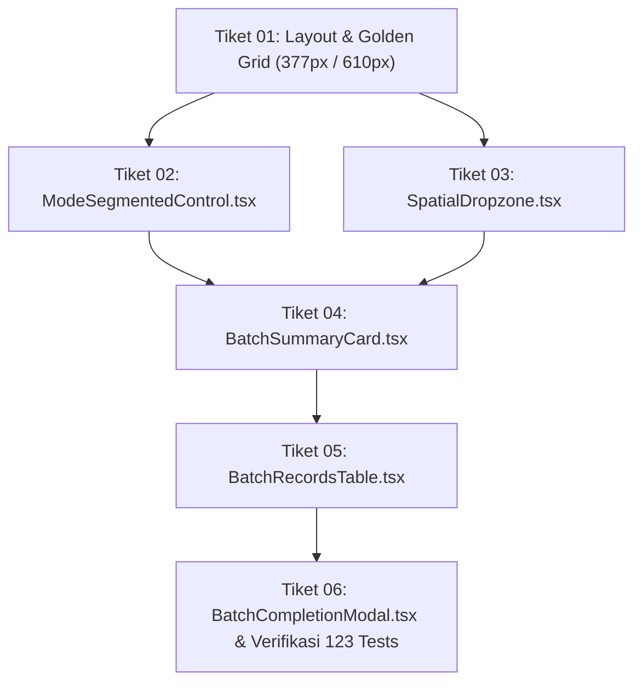

# Dokumen Handoff Sesi 6: SaaS Platform Monitoring Pertanian Presisi "Tani"

**Status Proyek:** 
- **Fase Fondasi (Wave 1 s/d Wave 6):** 100% Selesai (Tiket 01 s/d Tiket 17)
- **Fase Ekstensi Geospasial (Wave 7 — KML/KMZ/GeoJSON Import Pipeline):** 100% Selesai (Tiket 01 s/d Tiket 06)
- **Fase Sinkronisasi Lanjutan & Impor Massal (Wave 8 — Auto-Centroid, Satellite Backfill & Batch Wizard):** 100% Selesai (Tiket 01 s/d Tiket 06, 123 Passed Tests)
- **Fase Desain Apple Editorial, Komposisi Fibonacci & Beautiful UI (Wave 9 — 100% Pure Light Mode):** Siap Implementasi (Spec & 6 Tiket Komponen Modular di `/implement`)
**Tanggal:** 5 September 2026  
**Lingkup:** Backend FastAPI (PostGIS/SQLAlchemy Async + Alembic), Frontend Next.js 14 App Router (Tailwind CSS, Mapbox GL JS, Recharts), Processing Pipeline (GEE, Open-Meteo, FAO-56 Penman-Monteith, GDD Jagung & Padi, Alert Engine 4 Aturan, ReportLab PDF, CSV Export, SMTP Email Notification), APScheduler Cron Jobs, serta Fitur Impor Geospasial KML/KMZ/GeoJSON Tunggal & Massal.

---

## 1. Instruksi Eksekusi Sesi Berikutnya (`/implement`)

Pada sesi berikutnya, agen dapat langsung mengeksekusi Wave 9 dengan perintah:
```bash
/implement D:\PEREWANGAN 369\Tani\handoff\HANDOFF.md . Pakai fleet worker. Kasih auto approve. HARUS AUTO APPROVE
```

### Urutan Eksekusi Frontier & Dependensi Tiket:


1. **Tiket 01** (`01-pure-light-theme-purge-and-fibonacci-grid.md`): Refaktor layout `page.tsx`, hilangkan `bg-slate-900`, atur grid Fibonacci (`w-[377px]` / `w-[610px]`), dan tipografi Apple Editorial (`font-serif text-[24px]`).
2. **Tiket 02** (`02-beautifului-segmented-pill-switcher.md`): Buat komponen `frontend/src/components/plot/ModeSegmentedControl.tsx` (~60 baris) dengan pill switch Beautiful UI (`bg-[#f4f4f5] rounded-full p-[3px]`, sliding capsule).
3. **Tiket 03** (`03-beautifului-canvas-dropzone-uploader.md`): Buat komponen `frontend/src/components/plot/SpatialDropzone.tsx` (~90 baris) dengan pure white canvas dropzone, hairline dashed border, dan avatar sirkular hijau sage.
4. **Tiket 04** (`04-beautifului-task-rows-summary-card.md`): Buat komponen `frontend/src/components/plot/BatchSummaryCard.tsx` (~110 baris) adopsi Beautiful UI #06 Task Rows (angka tabular-nums, pill badges Ha, dan quick bulk controls).
5. **Tiket 05** (`05-beautifului-records-table-inline-controls.md`): Buat komponen `frontend/src/components/plot/BatchRecordsTable.tsx` (~130 baris) adopsi Beautiful UI #12 Records Table (padding 13px Fibonacci, hairline dividers, rounded checkboxes, tombol aksi spekular).
6. **Tiket 06** (`06-apple-glassmorphism-map-and-telemetry-modal.md`): Buat komponen `frontend/src/components/plot/BatchCompletionModal.tsx` (~80 baris), floating glassmorphism map controls (`backdrop-blur-xl bg-white/80`), integrasikan ke `page.tsx`, dan jalankan verifikasi tes suite 123 tes unit.

---

## 2. Ringkasan Eksekutif Pekerjaan yang Telah Selesai (Wave 8)

Seluruh 6 tiket Wave 8 telah 100% selesai dan terkomit di repositori:
1. **Auto-Centroid Estate GPS (Tiket 01):** `ensure_estate_centroid_from_polygon` di `backend/app/services/estate_service.py` otomatis mengisi GPS estate dan memicu cuaca Open-Meteo & $ET_0$.
2. **Multi-Placemark KML & GeoJSON Parser (Tiket 02):** `parse_multi_spatial_file` di `backend/app/utils/kml_parser.py` mengekstrak seluruh poligon, menghitung luas geodesik WGS84, akumulasi total luas, dan *unified bounding box*.
3. **Batch Spatial Import Preview API (Tiket 03):** Endpoint `POST /api/plots/batch-import-preview` mengembalikan skema `PlotBatchImportPreviewResponse`.
4. **30-Day Historical Satellite Telemetry Backfill (Tiket 04):** `satellite_backfill_service.py` menghasilkan 6 titik observasi interval 5 hari (30 hari ke belakang) dengan kurva fenologi vegetasi sigmoidal realistis (NDVI 0.20–0.85, NDRE, NDWI, SAVI, BSI, SAR).
5. **Batch Import Wizard UI & Multi-Polygon Mapbox Viewer (Tiket 05):** Antarmuka di `frontend/src/app/admin/petak-baru/page.tsx` dengan tab switcher, layer Mapbox reaktif (`batch-polygons-fill`, `batch-polygons-line`), dan auto `fitBounds`.
6. **Bulk Plot Registration & Telemetry Activation (Tiket 06):** Endpoint `POST /api/plots/batch-create` menyimpan seluruh petak dalam satu transaksi database atomik, memperbarui sentroid estate, memicu cuaca/GDD, dan mengeksekusi backfill telemetri satelit 30 hari.
7. **Verifikasi Suite Uji:** 123 tests (`python -m unittest discover -s tests -p "test_*.py"`) lulus 100% (115 passed, 8 skipped integration tests, 0 failures).

---

## 3. Rincian Desain & Arsitektur Wave 9 (Siap Dijalankan)

* **Spesifikasi:** [`.scratch/wave-9-apple-editorial-ui/spec.md`](file:///D:/PEREWANGAN%20369/Tani/.scratch/wave-9-apple-editorial-ui/spec.md)
* **Direktori Tiket:** [`.scratch/wave-9-apple-editorial-ui/issues/`](file:///D:/PEREWANGAN%20369/Tani/.scratch/wave-9-apple-editorial-ui/issues/)
* **Karakteristik Desain:**
  - **100% Pure Light Theme:** Hapus seluruh kelas gelap (`bg-slate-900`, `border-slate-700`). Background utama `#fbfbfb` / `#ffffff`, border `border-black/[0.06]`.
  - **Apple Editorial Typography:** Judul `font-serif text-[24px] tracking-[-0.025em] text-[#09090b]` dipadu subtitle santun sans-serif `text-[13px] text-[#71717a]`.
  - **Harmonic Fibonacci Composition:** Rasio kolom emas `w-[377px]` / `w-[610px]` terhadap peta `987px` (~61.8%). Skala spasi `px-[21px] py-[34px]`, `gap-[21px]`, `gap-[13px]`, `p-[13px]`, `rounded-[21px]`, `rounded-[13px]`.
  - **Komponen Murni Beautiful UI (`https://www.beautifului.dev/`):**
    - `ModeSegmentedControl.tsx` (Pill Switcher Beautiful UI, ~60 baris).
    - `SpatialDropzone.tsx` (Canvas Dropzone Beautiful UI, ~90 baris).
    - `BatchSummaryCard.tsx` (Task Row Beautiful UI #06, ~110 baris).
    - `BatchRecordsTable.tsx` (Records Table Beautiful UI #12, ~130 baris).
    - `BatchCompletionModal.tsx` (Approval Card Beautiful UI #04, ~80 baris).

---

## 4. Catatan Runtime & Lingkungan Pengujian

- **Python Host Executable:** `C:\Users\M S I\AppData\Roaming\uv\python\cpython-3.11-windows-x86_64-none\python.exe`.
- **Perintah Uji Backend:**
  ```powershell
  & "C:\Users\M S I\AppData\Roaming\uv\python\cpython-3.11-windows-x86_64-none\python.exe" -m unittest discover -s tests -p "test_*.py"
  ```
  *(Jalankan dari direktori `backend/`, saat ini 123 tests lolos tanpa kegagalan).*
- **Perintah Frontend (jika diperlukan):** Jalankan via `cmd.exe /c npm ...` atau `npm.cmd` di direktori `frontend/`.
- **Git Branch:** `master`.
