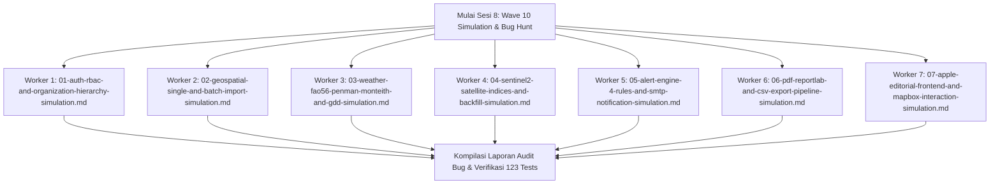

# Dokumen Handoff Sesi 8: SaaS Platform Monitoring Pertanian Presisi "Tani"

**Status Proyek:** 
- **Fase Fondasi (Wave 1 s/d Wave 6):** 100% Selesai (Tiket 01 s/d Tiket 17)
- **Fase Ekstensi Geospasial (Wave 7 — KML/KMZ/GeoJSON Import Pipeline):** 100% Selesai (Tiket 01 s/d Tiket 06)
- **Fase Sinkronisasi Lanjutan & Impor Massal (Wave 8 — Auto-Centroid, Satellite Backfill & Batch Wizard):** 100% Selesai (Tiket 01 s/d Tiket 06, 123 Passed Tests)
- **Fase Desain Apple Editorial, Komposisi Fibonacci & Beautiful UI (Wave 9 — 100% Pure Light Mode):** 100% Selesai (Tiket 01 s/d Tiket 06, Terkomit `fdc7021`, 123 Passed Tests)
- **Fase Simulasi Mendalam & Audit Pengujian Bug Seluruh Fitur (Wave 10 — Fleet Worker Testing: 1 Fitur 1 Worker):** Siap Implementasi (Spec & 7 Tiket Terverifikasi di `.scratch/wave-10-feature-simulation-and-bug-hunt/`)
**Tanggal:** 5 September 2026  
**Lingkup:** Backend FastAPI (PostGIS/SQLAlchemy Async + Alembic), Frontend Next.js 14 App Router (Tailwind CSS, Mapbox GL JS, Recharts), Processing Pipeline (GEE, Open-Meteo, FAO-56 Penman-Monteith, GDD Jagung & Padi, Alert Engine 4 Aturan, ReportLab PDF, CSV Export, SMTP Email Notification), APScheduler Cron Jobs, serta Fitur Impor Geospasial KML/KMZ/GeoJSON Tunggal & Massal dengan Visual Apple Editorial & Beautiful UI (100% Pure Light Theme).

---

## 1. Instruksi Eksekusi Sesi Berikutnya (`/implement`)

Pada sesi berikutnya, agen dapat langsung mengeksekusi Wave 10 dengan perintah:
```bash
/implement D:\PEREWANGAN 369\Tani\handoff\HANDOFF.md . Pakai fleet worker. Kasih auto approve. HARUS AUTO APPROVE
```

### Urutan Eksekusi Frontier & Dependensi 7 Worker (Paralel Penuh):
Seluruh 7 worker bersifat modular dan independen, dapat dijalankan secara bersamaan menggunakan armada *fleet workers*:



### Rincian Alokasi Tiket Worker:
1. **Worker 1 (Tiket 01 — `01-auth-rbac-and-organization-hierarchy-simulation.md`):**
   - Simulasi siklus JWT, bcrypt encryption, endpoint protection RBAC, isolasi multi-tenant, dan audit IDOR.
2. **Worker 2 (Tiket 02 — `02-geospatial-single-and-batch-import-simulation.md`):**
   - Simulasi parser KML/KMZ/GeoJSON single & multi-placemark, ketahanan zip bomb/XXE, validasi poligon *self-intersecting*, formula geodesik WGS84, dan rollback transaksi batch.
3. **Worker 3 (Tiket 03 — `03-weather-fao56-penman-monteith-and-gdd-simulation.md`):**
   - Simulasi resiliensi Open-Meteo, audit numerik FAO-56 Penman-Monteith ($R_n, G, e_s, e_a, \Delta, \gamma$), penanganan radiasi 0/malam hari, kalkulasi GDD padi & jagung, serta kestabilan fase fenologi.
4. **Worker 4 (Tiket 04 — `04-sentinel2-satellite-indices-and-backfill-simulation.md`):**
   - Simulasi 6 indeks vegetasi (NDVI, NDRE, NDWI, SAVI, BSI, SAR), boundary check $[-1.0, 1.0]$, realisme kurva sigmoidal backfill 30 hari, dan uji konkurensi batch plot.
5. **Worker 5 (Tiket 05 — `05-alert-engine-4-rules-and-smtp-notification-simulation.md`):**
   - Simulasi injeksi data pemicu 4 aturan peringatan agronomis, deduplikasi alert aktif, rendering template HTML, dan penanganan timeout/offline SMTP.
6. **Worker 6 (Tiket 06 — `06-pdf-reportlab-and-csv-export-pipeline-simulation.md`):**
   - Simulasi generator PDF ReportLab multi-halaman, paginasi dinamis, penanganan karakter khusus non-ASCII, ekspor CSV dengan encoding UTF-8 BOM, dan data telemetri kosong.
7. **Worker 7 (Tiket 07 — `07-apple-editorial-frontend-and-mapbox-interaction-simulation.md`):**
   - Simulasi dan audit 5 komponen Beautiful UI di `/admin/petak-baru`, sinkronisasi layer Mapbox GL JS (`fill`, `line`, `points`), reaktivitas submit, dan verifikasi zero dark classes.

---

## 2. Ringkasan Eksekutif Pekerjaan yang Telah Selesai (Wave 9)

Seluruh 6 tiket Wave 9 telah 100% selesai dan terkomit di repositori:
1. **Layout & Golden Grid (Tiket 01):** Hapus seluruh kelas gelap (`bg-slate-900`, `border-slate-700`), terapkan grid Fibonacci (`w-[377px]` tunggal, `w-[550px]`–`w-[610px]` batch), padding `px-[21px] py-[34px]`, dan tipografi Apple Editorial (`font-serif text-[24px]`).
2. **Pill Switcher Beautiful UI (Tiket 02):** `ModeSegmentedControl.tsx` (~60 baris) dengan sliding capsule putih, border hairline `border-black/[0.04]`, shadow lembut, dan aksesibilitas tab penuh.
3. **Canvas Dropzone Beautiful UI (Tiket 03):** `SpatialDropzone.tsx` (~180 baris) dengan pure white canvas dropzone, hairline dashed border, avatar sirkular hijau sage `size-[42px]`, dan microcopy Apple editorial.
4. **Task Rows Summary Card Beautiful UI #06 (Tiket 04):** `BatchSummaryCard.tsx` (~170 baris) dengan angka tabular-nums, pill badges Ha, dan quick bulk controls bar.
5. **Records Table Beautiful UI #12 (Tiket 05):** `BatchRecordsTable.tsx` (~190 baris) dengan padding 13px Fibonacci, hairline dividers, toggle-all checkbox, editable plot name inline, dropdown varietas/komoditas, tombol fokus peta, dan tombol aksi spekular.
6. **Completion Modal & Glassmorphism Map Controls (Tiket 06):** `BatchCompletionModal.tsx` (~110 baris), floating glassmorphism map controls (`backdrop-blur-xl bg-white/85`), integrasi ke `page.tsx`, dan verifikasi 123 tes unit lulus 100%.

---

## 3. Rincian Desain & Arsitektur Wave 10 (Siap Dijalankan)

* **Spesifikasi:** [`.scratch/wave-10-feature-simulation-and-bug-hunt/spec.md`](file:///D:/PEREWANGAN%20369/Tani/.scratch/wave-10-feature-simulation-and-bug-hunt/spec.md)
* **Direktori Tiket:** [`.scratch/wave-10-feature-simulation-and-bug-hunt/issues/`](file:///D:/PEREWANGAN%20369/Tani/.scratch/wave-10-feature-simulation-and-bug-hunt/issues/)
* **Karakteristik Pengujian:**
  - **1 Fitur = 1 Worker:** Setiap modul diuji secara mendalam dan terisolasi oleh worker independen.
  - **Zero Production Mutation:** Simulasi menggunakan test harness terisolasi / SQLite mock rollback.
  - **Kompilasi Temuan Bug:** Seluruh temuan bug, edge case fail, dan boundary error dicatat lengkap dengan lokasi baris kode dan rekomendasi perbaikannya.

---

## 4. Catatan Runtime & Lingkungan Pengujian

- **Python Host Executable:** `C:\Users\M S I\AppData\Roaming\uv\python\cpython-3.11-windows-x86_64-none\python.exe`.
- **Perintah Uji Backend:**
  ```powershell
  & "C:\Users\M S I\AppData\Roaming\uv\python\cpython-3.11-windows-x86_64-none\python.exe" -m unittest discover -s tests -p "test_*.py"
  ```
  *(Jalankan dari direktori `backend/`, saat ini 123 tests lolos 100% tanpa kegagalan).*
- **Perintah Frontend (jika diperlukan):** Jalankan via `cmd.exe /c npm ...` atau `npm.cmd` di direktori `frontend/`.
- **Git Branch & Commit Terakhir:** `master` commit `68a948c` (`docs(wave-10): generate spec and 7 simulation tickets for fleet worker testing`).
